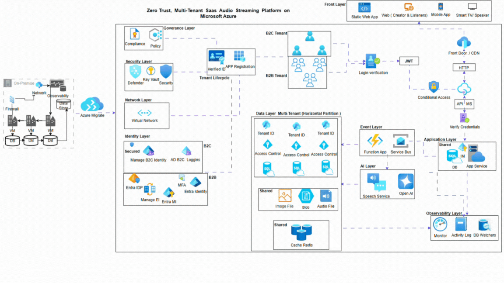
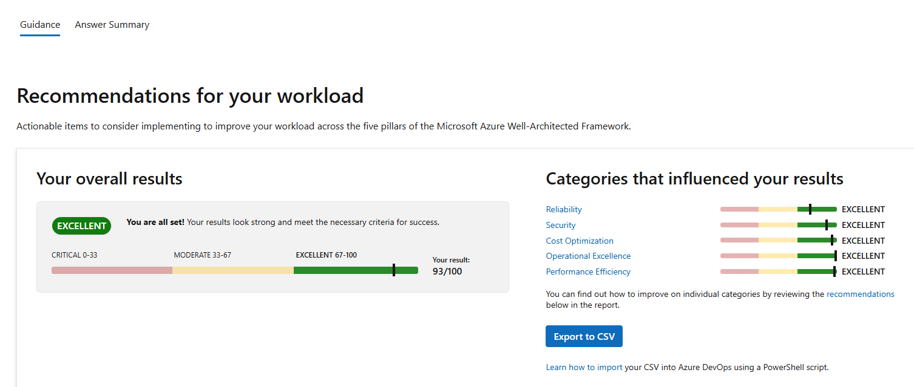

# Zero Trust, Multi-Tenant SaaS Audio Streaming Platform on Microsoft Azure


## Overview

This project implements a secure, scalable, and multi-tenant audio streaming platform hosted on **Microsoft Azure**. The architecture is cloud-native, PaaS-first, and designed to support both **B2B and B2C tenants**. It emphasizes compliance, high availability, and operational excellence while enabling AI-driven features.

---

## Key Features

- **Multi-Tenant Architecture:** Supports B2B and B2C users with tenant isolation  
- **Zero Trust Security:** Azure AD B2C, Entra ID, MFA, and secure access controls  
- **Scalable & Cost-Efficient:** PaaS-first deployment using Azure App Service, Functions, and Azure SQL  
- **Event-Driven Architecture:** Decoupled components with Azure Functions and Service Bus  
- **Observability & Monitoring:** Azure Monitor and Log Analytics for proactive operations  
- **AI & Intelligent Services:** Azure OpenAI and Speech Services for advanced user experiences  
- **Migration Ready:** Azure Migrate for on-premises assessment and right-sizing

---

## Architecture Overview

The platform is organized in layers:

1. **Edge & Traffic Management:** Azure Front Door  
2. **Frontend Layer:** Azure Static Web Apps  
3. **Identity & Tenant Management:** Azure AD B2C for B2C users, Entra ID for B2B users, MFA and Zero Trust  
4. **Application Layer:** Azure App Service for main business logic  
5. **Event & Integration Layer:** Azure Functions & Service Bus for decoupled event-driven processing  
6. **Data Layer:** Azure SQL (tenant-specific data), Blob Storage (shared app data), Redis Cache (performance optimization)  
7. **AI Layer:** Azure OpenAI & Speech Services for intelligent features  
8. **Observability Layer:** Azure Monitor, Log Analytics  
9. **Security Layer:** Microsoft Defender for Cloud, Azure Key Vault  
10. **Migration Layer:** Azure Migrate for workload onboarding  


.     


.   


---

## Justifications and Trade-offs

| Component | Purpose | Justification | Trade-off |
|-----------|--------|---------------|-----------|
| Azure Front Door | Global HTTP(S) routing & WAF | Ensures low latency, high availability, security | Higher cost vs regional load balancers |
| Azure Static Web Apps | Frontend UI | Cost-efficient, globally distributed, CI/CD ready | Limited backend execution; mitigated by App Service and Functions |
| Azure AD B2C / Entra ID | Identity management | Supports B2C and B2B tenants, MFA, Zero Trust | Increased configuration complexity |
| Azure App Service | Application hosting | Fully managed runtime, autoscaling, high availability | Less control than AKS; lower operational overhead |
| Azure Functions & Service Bus | Event-driven integration | Decouples components, improves scalability | Eventual consistency accepted |
| Azure SQL DB | Tenant-isolated transactional data | ACID compliance, partitioned multi-tenancy | Multi-database management overhead |
| Blob Storage | Shared application data | Durable, scalable object storage | No ACID transactions; suitable for non-transactional data |
| Redis Cache | Performance optimization | Reduces SQL load, improves latency | Extra service to manage, added cost |
| Azure Monitor & Log Analytics | Observability | Centralized monitoring, proactive operations | Additional telemetry cost |
| Defender / Key Vault | Security | Threat detection, secret protection | Additional cost justified by compliance |
| Azure Policy / RBAC | Governance | Ensures compliance & security baselines | Reduced deployment flexibility |
| Azure Migrate | Migration | On-prem assessment and right-sizing | One-time cost |
| Azure OpenAI / Speech Services | AI features | Managed AI, enables intelligent interactions | Variable consumption cost |

---

## Getting Started

### Prerequisites

- Microsoft Azure subscription  
- Azure CLI or Azure Portal access  
- Git installed locally  

### Deployment

1. Clone the repository:

```
git clone https://github.com/Cloud-Architect-Emma/azure-zero-trust-multitenant-saas.git
cd azure-zero-trust-multitenant-saas
Follow the deployment instructions in docs/deployment.md for environment setup.
```

### Documentation
Architecture Diagram: docs/architecture-diagram.png

Design Document (SAD): docs/SAD_ZeroTrust_MultiTenant.docx

Pre-Deployment Validation: docs/WellArchitected_Results.PNG

Governance & Cost Model: docs/Governance_Cost_Model.md

Delivery Plan (Optional)
Phases: Foundation → Core Platform → Data & Integration → Security & Compliance → Observability & Optimisation → Advanced AI & Scaling

Risks: Tenant data leakage, cost overrun, identity misconfiguration, regional outages (with mitigations)

Next Steps: Architecture approval, landing zone setup, POC validation, cost baseline, security threat modelling

**Contributing**
Contributions are welcome! Please follow the guidelines in CONTRIBUTING.md.

**License**
This project is licensed under the MIT License. See LICENSE for details.

**Contact**
Solution Architect: Emma.
Email: emmanuela_prince@yahoo.com
